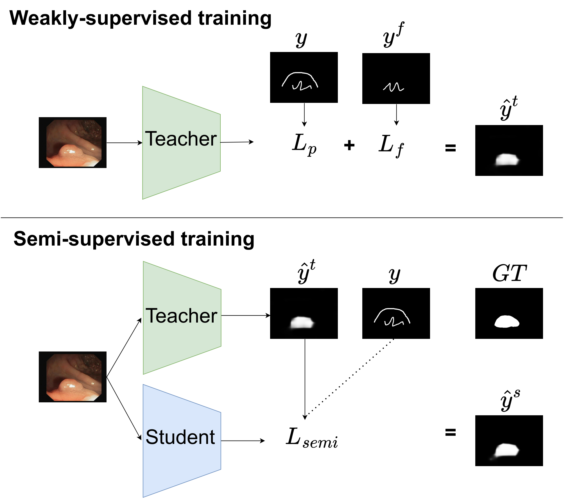
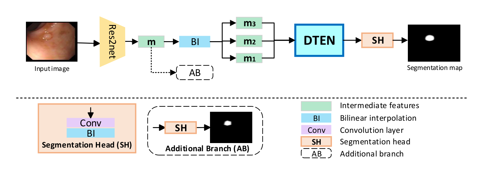
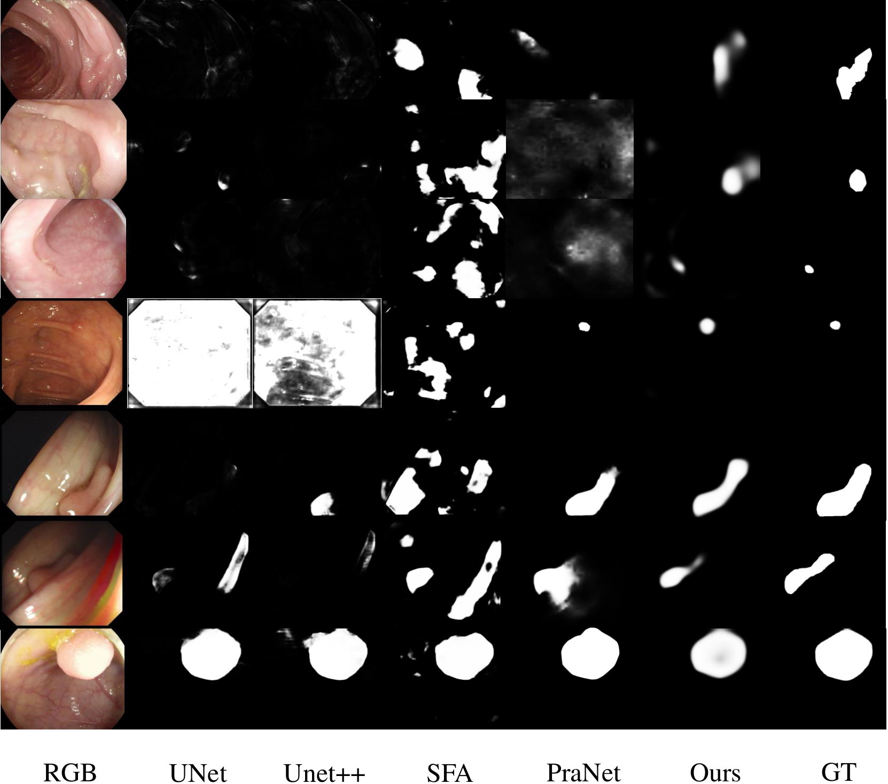

# WS-DefSegNet

This repo covers the implementation of the following paper: 

**"Towards Automated Polyp Segmentation Using Weakly- and Semi-Supervised Learning and Deformable Transformers (CVPR 2023 workshop)"** [Pre-print]([https://arxiv.org/abs/2211.11847](https://openaccess.thecvf.com/content/CVPR2023W/VISION/papers/Ren_Towards_Automated_Polyp_Segmentation_Using_Weakly-_and_Semi-Supervised_Learning_and_CVPRW_2023_paper.pdf))

**Training procedure**

<p align='center'>
  
</p>

**Architecture**

<p align='center'>
  
</p>

## Abstract
Polyp segmentation is a crucial step towards computer-aided diagnosis of colorectal cancer. However, most of the polyp segmentation methods require pixel-wise annotated datasets. Annotated datasets are tedious and time-consuming to produce, especially for physicians who must dedicate their time to their patients. To this end, we propose a novel weakly- and semi-supervised learning polyp segmentation framework that can be trained  using only weakly annotated images along with unlabeled images making it very cost-efficient to use. More specifically our contributions are: 1) a novel weakly annotated polyp dataset, 2) a novel sparse foreground loss that suppresses false positives and improves weakly-supervised training, 3) a deformable transformer encoder neck for feature enhancement by fusing information across levels and flexible spatial locations.

Extensive experimental results demonstrate the merits of our ideas on five challenging datasets
outperforming some state-of-the-art fully supervised models. Also, our framework can be utilized to fine-tune models trained on natural image segmentation datasets drastically improving their performance for polyp segmentation and impressively demonstrating superior performance to fully supervised fine-tuning.

If you find this repo useful for your research, please consider citing the paper
```
@InProceedings{Ren_2023_CVPR,
    author    = {Ren, Guangyu and Lazarou, Michalis and Yuan, Jing and Stathaki, Tania},
    title     = {Towards Automated Polyp Segmentation Using Weakly- and Semi-Supervised Learning and Deformable Transformers},
    booktitle = {Proceedings of the IEEE/CVF Conference on Computer Vision and Pattern Recognition (CVPR) Workshops},
    month     = {June},
    year      = {2023},
    pages     = {4354-4363}
}
```

## Datasets
* Training Dataset: https://drive.google.com/file/d/1lODorfB33jbd-im-qrtUgWnZXxB94F55/view
  Download the RGB training images and use the new weakly ground truth
  
* Testing Dataset: https://drive.google.com/file/d/1o8OfBvYE6K-EpDyvzsmMPndnUMwb540R/view

* Weakly annotations: https://drive.google.com/drive/folders/1It-ZUIXJWJrKvveKgIfZBCPdfcIGqqtC?usp=sharing


## Requirement
* Python 3.7
* PyTorch 1.5.0
* torchvision
* numpy
* Pillow
* Cython
* mmcv


## Training Model

### Weakly-Supervised Training
* 1.Set the path of training sets in config.py 
* 2.Change the dataset names in dataset_weakly.py
* 3.Run weakly_train.py (750 labeled data with sparse annotations)


### Semi-Supervised Training
* 1.Change the dataset names in dataset_semi.py 
* 2.Run semi_train.py (750 labeled data with sparse annotations and 700 unlabeled data)

### Fully supervised Training
* 1.Set the path of training sets in config.py  
* 2.Change the dataset names in dataset_fully.py
* 3.Run regular_train.py (dense annotations)

## Testing
* 1.Set the path of testing sets in config.py    
* 2.Run test.py (can generate the predicted saliency maps on several datasets)  
* 3.Run test_score.py (mdice, miou)

## Visual comparisons with State of the art

<p align='center'>
  
</p>


